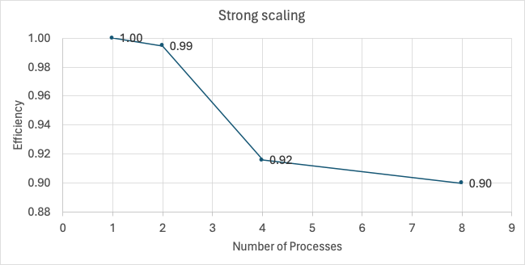
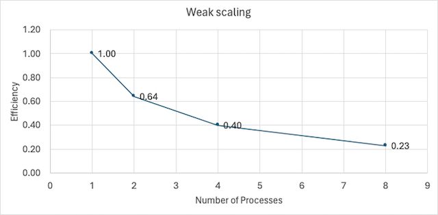

# Parallel post-processing for Vehicle Routing Problem (VRP)

# Introduction

Vehicle Routing Problem (VRP) is an NP-hard problem. There are many heuristics to solve the VRP problem that provide near-optimal solutions. 

However, solving the VRP is not always the end. Sometimes we need to do some post-processing on the routes, for example: in collaborative routing problem, one issue is to distribute the cost of the tour among the participants in a fair manner. It turns out that this issue of fairness can be solved using a linear program for each of the routes produced by the initial VRP solution. However, depending on the problem, we might have numerous routes to solve, and doing it sequentially could be time-consuming. Since the routes are independent of each other, this provides us with a perfect opportunity to parallelize the problem. 

In this project, we consider solving a VRP that has around 400 individual nodes and the initial heuristic produces approximately 151 routes (the initial heuristic is not provided here, only the routes produced by the heuristic are provided in a .pkl file, this file acts as the input for the main.py program). We consider doing the post-processing step for these 151 routes in parallel distributed among multiple processors.

# Methodolgy and Preliminary Result

We use OpenMP API in Python to do the parallelization. We then analyze the parallelization efficiency through strong scaling and weak scaling. 

# Analysis

The strong scaling result is as we typically expect from parallelization. However, the weak scaling efficiency is low. This is because, even though the number of nodes is the typical measure of complexity in VRPs, it is not a perfect one. In fact, the complexity ultimately depends on the number of variables and the number of constraints. In this specific VRP problem, the number of variables scales linearly as the number of nodes increases. However, the number of constraints does not scale linearly with the number of nodes; rather, it increases exponentially. This is why the weak scaling efficiency is so low. In other words, even though we increase the number of processors proportional to the number of nodes, the efficiency drops because the number of constraints increases exponentially with the number of nodes (see the table below). So why do we use the number of nodes as the measure of complexity in the first place? This is because we cannot know apriori how the number of number constraints will grow for linear programs with respect to the number of nodes. In addition, there are usually redundant constraints present in the model. This is why the number of constraints is not used to describe the complexity. Rather, the number of nodes is typically selected to express the problem's complexity. However, it does not always fully capture the problem's complexity, as we have seen from this project.

| num_nodes | num_var | num_constr | factor_var | factor_constr |
|:---------:|:-------:|:----------:|:----------:|:-------------:|
|     50    |   162   |    2466    |      1     |       1       |
|    100    |   328   |    9932    |    2.02    |      4.03     |
|    200    |   666   |    39870   |    4.11    |     16.17     |
|    400    |   1270  |   149724   |    7.84    |     60.72     |

# Final result

Just to verify that the weak scaling, in this case, should be done with respect to the number of constraints instead of the number of nodes, we run another simulation where we increase the number of processors with respect to the constraints. For example, we employ 4 workers for the second data point since it has approximately 4 times more constraints than the first data point. Similarly, for the third data point we employ 16 nodes. We omit the last case since it has around 60 times more constraints than the first data point and we would need a lot of processors for that. The results are presented below:

# Conclusion
