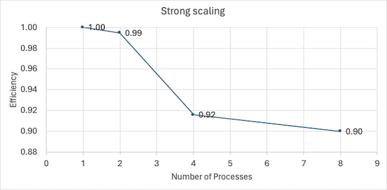

## Parallel post-processing for Vehicle Routing Problem (VRP)

Vehicle Routing Problem (VRP) is a NP-hard problem. There are many heuristics to solve VRP problem that provides near-optimal solution. 

However, solving the VRP is not always the end. Sometimes we need to do some post-processing on the routes, for example: in collaborative routing problem, one issue is to distribute the cost of the tour among the participants in a fair manner. It turns out that this issue of fairness can be solved using a linear program for each of the route produced by the initial VRP solution. However, depending on the problem, we might have numerous routes to solve for and doing it sequentially could be time consuming. Since the routes are independent of each other, this provides us with a perfect opportunity to parallelize the problem. 

In this project, we consider solving a VRP that has around 400 individual nodes and the initial heuristic produces approximately 151 routes (the initial heuristic is not provided here, only the routes produced by the heuristic are provided in a .pkl file, this file acts as the input for the main.py program). We consider doing the post-processing step for these 151 routes in parallel distributed among multiple processors.

We then analyze the parallelization efficiency through strong scaling and weak scaling. 

The strong scaling result is as we typically expect from parallelization. However, the weak scaling efficiency is low. This is because, even though the number of nodes are the typical measure of complexity in VRPs, it is not a perfect one. In fact, the complexity actually depends on the number of variables and the number of constraints. In this specific VRP problem, the number of variables scales linearly as the number of nodes increases. However, the number of constraints do not scale linearly with the number of nodes, rather it increases exponentially. This is why the weak scaling efficiency is so low. In other words, even though we increase the number of processors proportional to the number of nodes, the efficiecy drops because the number of constraints increases exponentially with the number of nodes (see the table below). So why do we use the number of nodes as the measure of complexity in the first place? This is because we cannot know apriori how the number of nodes and the number constraints will grow for linear programs. The number of nodes is typically selected to express the problem complexity, however, it does not always quite capture the problem complexity fully, as we have seen from this project.

| num_nodes | num_var | num_constr | factor_var | factor_constr |
|:---------:|:-------:|:----------:|:----------:|:-------------:|
|     50    |   162   |    2466    |      1     |       1       |
|    100    |   328   |    9932    |    2.02    |      4.03     |
|    200    |   666   |    39870   |    4.11    |     16.17     |
|    400    |   1270  |   149724   |    7.84    |     60.72     |